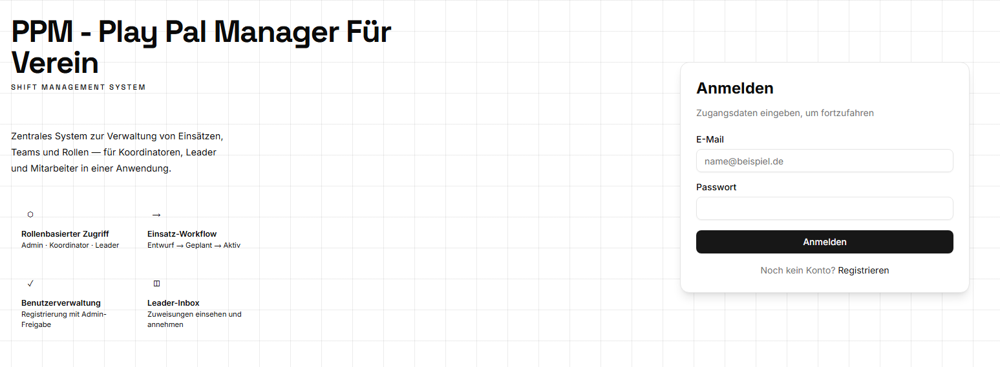
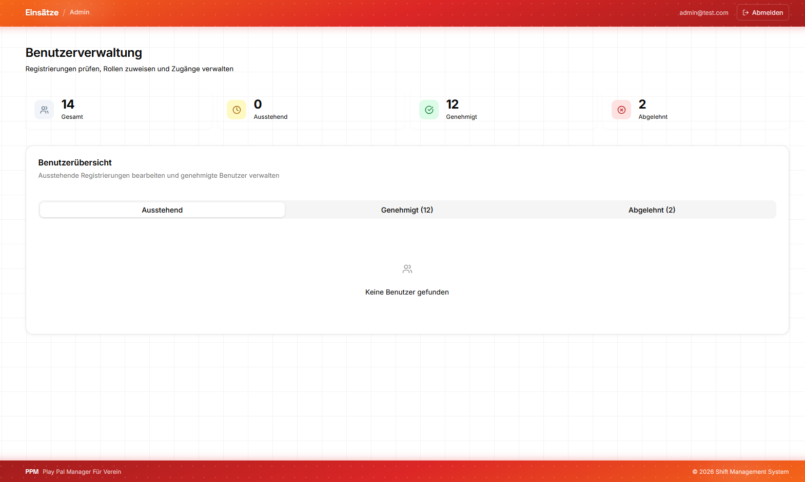
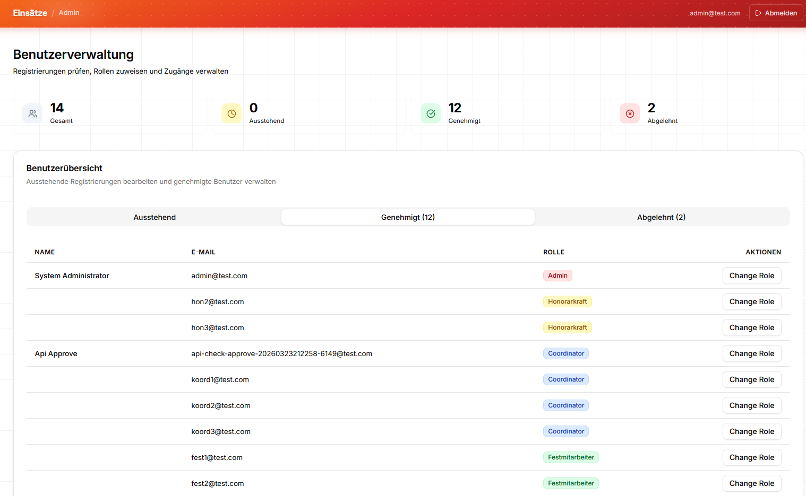
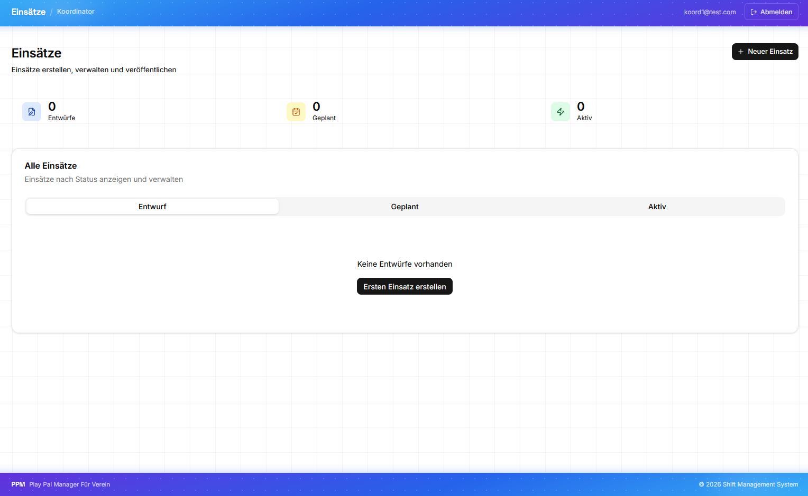
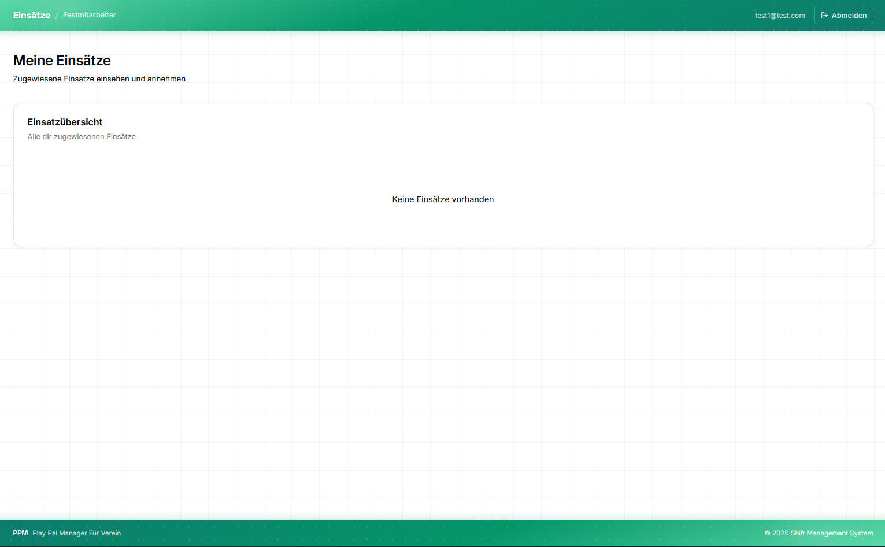

# PPM – Shift Management System

A Next.js web frontend for managing shifts and team assignments, backed by a .NET REST API. Built with role-based access control across four distinct user roles.

---

## Screenshots

<table>
  <tr>
    <td align="center" width="50%">
      
      <sub><b>Landing Page</b></sub>
    </td>
    <td align="center" width="50%">
      
      <sub><b>Admin – User Management</b></sub>
    </td>
  </tr>
  <tr>
    <td align="center" width="50%">
      
      <sub><b>Admin – Role Overview</b></sub>
    </td>
    <td align="center" width="50%">
      
      <sub><b>Coordinator – Shifts</b></sub>
    </td>
  </tr>
  <tr>
    <td align="center" width="50%">
      
      <sub><b>Staff – Shift Inbox</b></sub>
    </td>
    <td align="center"></td>
  </tr>
</table>

---

## Features

- **Role-based access control** — four roles: Admin, Coordinator, Festmitarbeiter, Honorarkraft
- **Shift workflow** — Draft → Planned → Active → Completed / Cancelled
- **User management** — registration with admin approval and role assignment
- **Shift management** — coordinators create and publish shifts with leader assignment
- **Leader inbox** — assigned staff view and accept their shifts
- **Responsive UI** — built with shadcn/ui and Tailwind CSS

## Tech Stack

| Layer | Technology |
|---|---|
| Framework | Next.js 16 (App Router) |
| Language | TypeScript 5 |
| UI | shadcn/ui, Radix UI |
| Styling | Tailwind CSS |
| Forms | React Hook Form + Zod |
| Auth | JWT (Bearer token) |
| Deployment | Vercel |

## Local Development

**Prerequisites:** Node.js 18+, running .NET backend (default: `http://localhost:5105`)

```bash
npm install
npm run dev
```

Create a `.env.local` file and set the backend URL:

```env
NEXT_PUBLIC_API_BASE_URL=http://localhost:5105
```

## Roadmap

- BFF pattern with HttpOnly cookies (replacing JWT in localStorage)
- Availability-based dropdowns for locations and leader selection
- 409 conflict handling for scheduling overlaps
- Additional client support (e.g. .NET MAUI)
